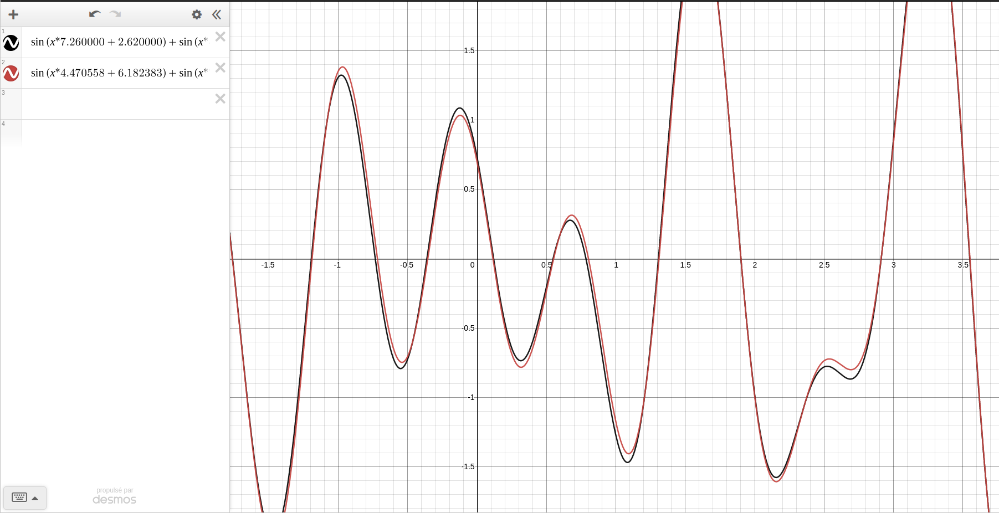
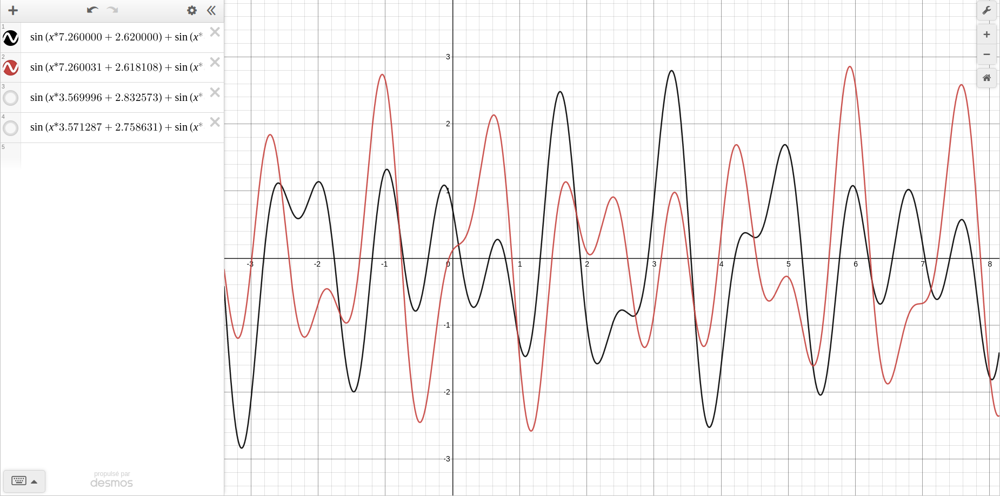
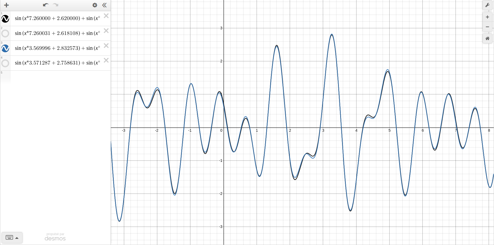
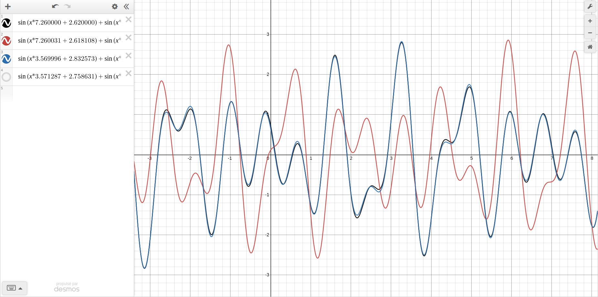
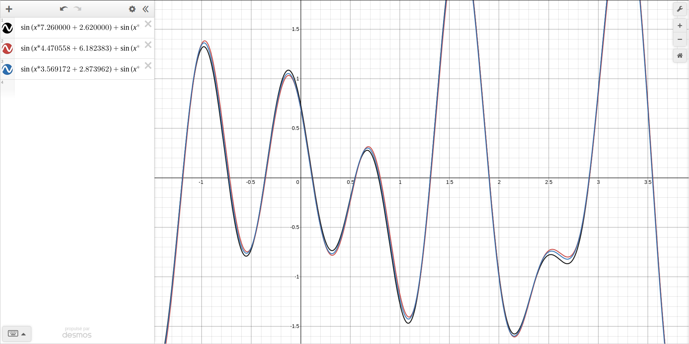
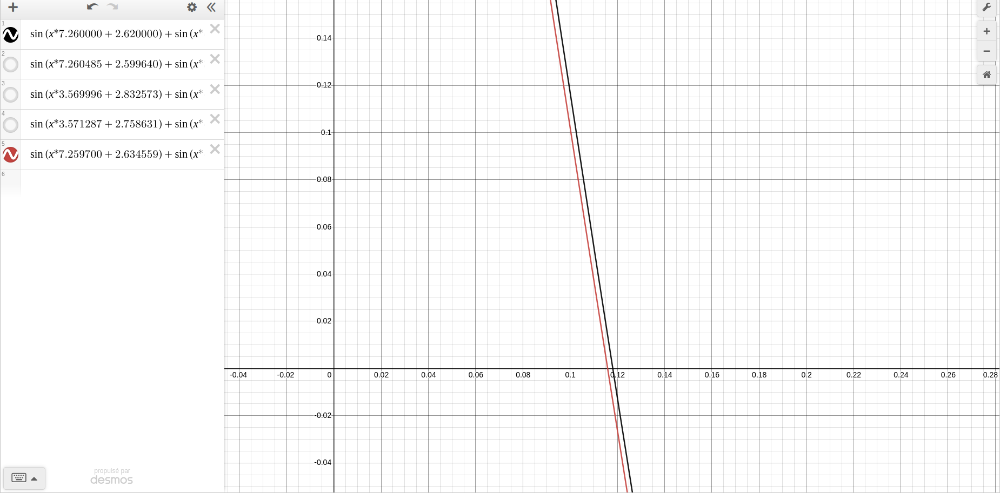
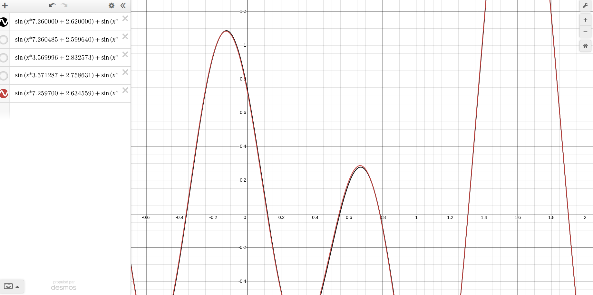
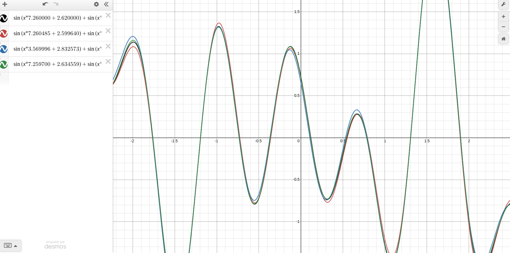

= Rapport du projet
Ali Darwich <ali.Darwich@etu.unistra.fr>;
v1.0, 2022-01-14 +
:toc: macro
:doctype: Article
:homepage: https://git.unistra.fr/adarwich/optim/

toc::[]

== introduction

*****
L’objectif est de voir si l’évolution pourra prescrire des probabilités de croisement
quasi nulles à l’intérieur d’un même sinus ou pas. Si c’est le cas, cela montrera que nous aurons un croisement
auto-adaptatif “intelligent” capable, de lui-même, de déterminer l’épistasie (la corrélation) entre certains gènes.
*****

== présentation du problème

* **L’influence (ou non) de points de croisement tombant au milieu d’un sinus ou entre deux sinus**

* **La comparaison entre les runs précédents et des runs où les valeurs x0..x7 évoluent en même temps que le génome (par mutation et croisement)**

== Resultat

=== plot points de croisement tombant au milieu d’un sinus

****
include::logs/sinusit_11_2022-01-16_13-48-36-968.log[]
****

****
include::logs/sinusit_11_2022-01-16_13-52-40-182.log[]
****

==== les probs qu'on change les valeurs de sinus sont:

**0.186136 0.895364 0.547576 0.486443 0.502174 0.461888 0.041086 0.260013**

**0.613273 0.438312 0.0644815 0.298875 0.307368 0.671874 0.0986998 0.251067**

=== plot points de croisement entre deux sinus

image::plots/sin12.png[]

****
include::logs/sinusit_12_2022-01-16_13-53-42-202.log[]
****

****
include::logs/sinusit_12_2022-01-16_13-51-00-335.log[]
****
==== les probs qu'on change les valeurs de sinus sont:

**0.0502886 0.968821 0.74906 0.917252 0.875796 0.0501997 0.957647 0.36432**

**0.472113 0.769438 0.961811 0.711971 0.220519 0.231622 0.317335 0.807162**

=== voir différence

rouge est moins bon mais pas trop !
pas consitant!
On peut conclure qu'il n'y pas pas d'influence ...

== question b

si les probas sont proche de 0, cela montrera que nous aurons un croisement
auto-adaptatif “intelligent” capable, de lui-même,

=== plots

==== 100 gen
****
include::logs/sinusit_22_2022-01-16_14-13-46-352.log[]
****
==== 1000 gen
****
include::logs/sinusit_22_2022-01-16_14-04-15-189.log[]
****
==== 10000 gen
****
include::logs/sinusit_22_2022-01-16_14-16-13-15.log[]
****

==== les probs qu'on change les valeurs de sinus sont:

**0.00216911 8.55208e-05 0.00386071 0.00554889 0.00357392 0.00967946 0.00657251 0.00577217**

**0.001051  0.002468  0.004409  0.005455  0.001293  0.007629  0.006655  0.002260**

**0.00189468 0.000888565 0.000649089 0.00695411 0.00438976 0.000108344 0.00565931 0.00773423**

**0.008135  0.007802  0.009248  0.003416  0.005618  0.002350  0.005701  0.001136**

=== plot all

après 100 generation, on trouve que les trois méthodes "points de croisement tombant au milieu d’un sinus, points de croisement entre deux sinus et mutation croisement des point de croisement"
ménent au même résulats.

== Conclusion

les valeurs x0..x7 évoluent en même temps que le génome (par mutation et croisement)
sont proche de 0 ce qui indique que notre modèle est auto-adaptive.

On peut utliser les valeurs de points de croisement pour arrèter l'evolution, au lieu de nombre de generation.
