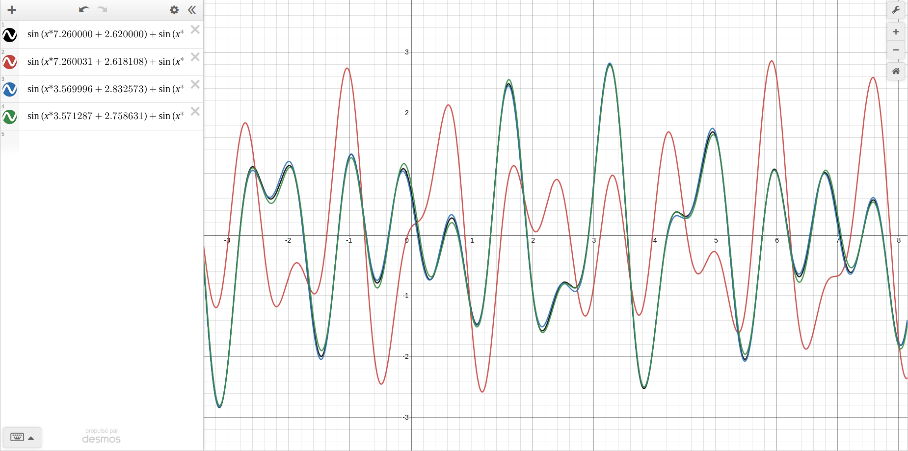

= Rapport du projet
Ali Darwich <ali.Darwich@etu.unistra.fr>;
v1.0, 2022-01-14 +
:toc: macro
:doctype: Article
:homepage: https://git.unistra.fr/adarwich/optim/

toc::[]

== introduction

*****
Lorem ipsum dolor sit amet, consectetur adipisicing elit, sed do eiusmod tempor incididunt ut labore et dolore magna aliqua. Ut enim ad minim veniam, quis nostrud exercitation ullamco laboris nisi ut aliquip ex ea commodo consequat. Duis aute irure dolor in reprehenderit in voluptate velit esse cillum dolore eu fugiat nulla pariatur. Excepteur sint occaecat cupidatat non proident, sunt in culpa qui officia deserunt mollit anim id est laborum.
*****

== présentation du problème

* **L’influence (ou non) de points de croisement tombant au milieu d’un sinus ou entre deux sinus**

NOTE: Pas du vrai influence je pense

* **La comparaison entre les runs précédents et des runs où les valeurs x0..x7 évoluent en même temps que le génome (par mutation et croisement)**

IMPORTANT: voir *.log

== Resultat

=== plot points de croisement tombant au milieu d’un sinus

image::plots/sin11.png[]
image::plots/sin11new.png[]

=== plot points de croisement entre deux sinus

image::plots/sin12.png[]
image::plots/sin12new.png[]

=== voir différence

image::plots/sin11et12.png[]
image::plots/sin11_&&_12.png[]

rouge est moins bon mais pas trop !
pas consitant!

== question b

le vert est quand on révalue la prob des locus a chaque gen

== Conclusion

NOTE: répondre au deux questions
